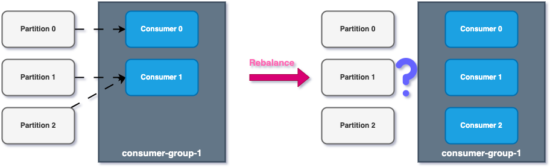
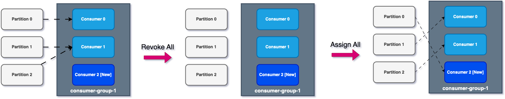
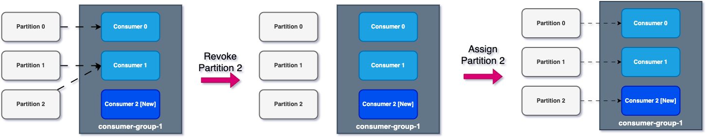
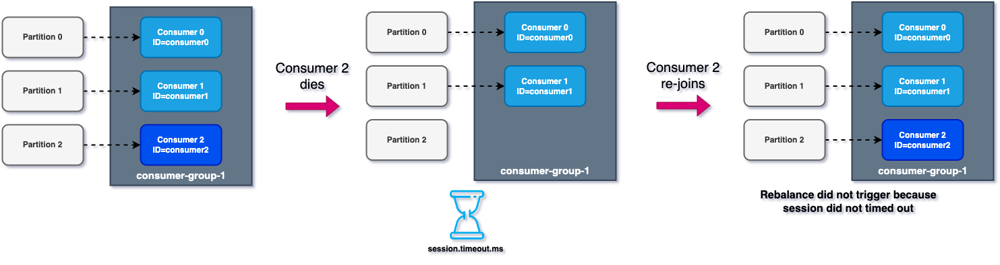

# Consumer Group and Partition Rebalance Strategies

-   Moving partitions between consumers is called a **rebalance**.
-   **Rebalance** happens when a consumer joins a consumer group.
-   It also happens if an administrator adds new partitions to a topic

## Eager Rebalance

When a new consumer joins the consumer group:

-   all partitions will stop
-   all consumers rejoin the group and get a new partition assignment
-   during a small portion of time, all consumers have stopped consuming messages.
-   Consumers are not guaranteed to return to their original partition.

## Cooperative Rebalance (Incremental Rebalance)

When a new consumer joins the consumer group:

-   Reassign a small subset of partitions from one consumer to another
-   other consumers who do not go through reassignment can keep consuming messages uninterrupted
-   can go through several iterations to find stable assignment
-   Avoids stopping all consumers

### How to use cooperative rebalance?

-   **Kafka consumer**: `partition.assignment.strategy.
    -   **RangeAssignor**, assigns partition per topic basis (can lead to imbalances)
    -   **RoundRobin**, assigns partitions across topics in round-robin fashion, optimal balance
    -   **StickyAssignor**, balanced like _RoundRobin_ but minimizes partition ressignement.
    -   **CoopeartiveStickyAssignor**, similar to _StickyAssignor_ but supports cooperative rebalance; consumers can keep consuming from a topic
    -   The default rebalance is **RangeAssignor** or **CoopeartiveStickyAssignor**, which will use the range assignor by default but will use the _CoopeartiveStickyAssignor_ with just a single rolling bounce that removes the _RangeAssignor_ from the list.
-   **Kafka Connect**: Already implemented by default
-   **Kafka Streams**: implemented by default using **StreamsPartitionAssignor**

## Static Group Membership

By default, when a consumer leaves the group, the partition is reassigned to another consumer.

-   If the partition joins back, it will have a new `memeber_id` and a new partition assigned
-   if you specify the `group.instance.id`, it makes a consumer a **static member**
-   If a consumer leaves, it has a `session.timeout.ms` to join back and get the same partition it was reading from without triggering rebalance; if the `session.timeout.ms` has expired, it will trigger rebalance
-   This is helpful when consumers maintain local state and cache (to avoid rebuilding the cache).

