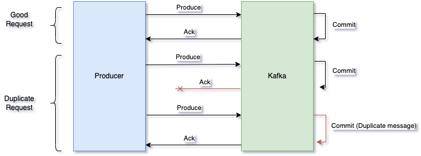
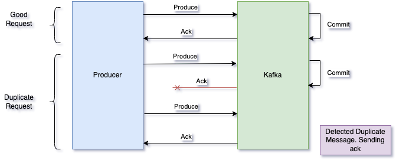

# Regular Producer

Regular producer can introduce duplicate messages when retrying send data that has not been ack.

# Idempotent Producer

In kafka `v0.11+` you can define an idempotent producer which will not duplicate messages

Idempotent producer are a great garantee as a stable and safe pipeline. From `v3.0` they are becoming the default! **Recomande to use it**.
When u set the Idempotent producer:

-   `retries=Integer.MAX_VALUE`
-   `max.in.flight.requests=1` in Kafka `v0.11` or
-   `max.in.flight.requests=5` in Kafka `v1+`
-   `acks=all`

These setting are set automatically with the idempotent producer with `producerProp.put("enable.idempotent", true);`
