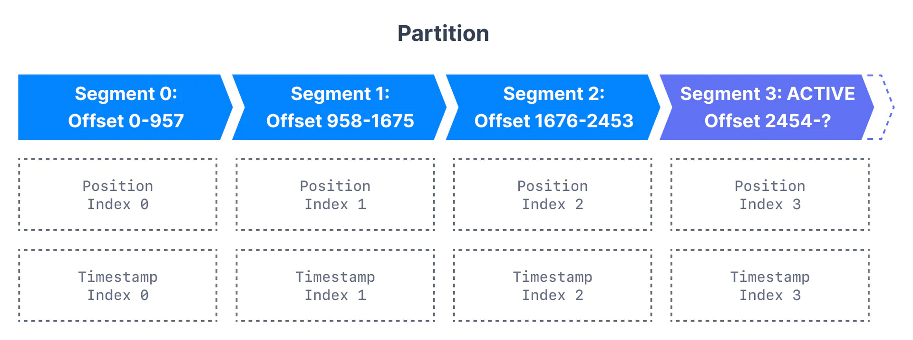
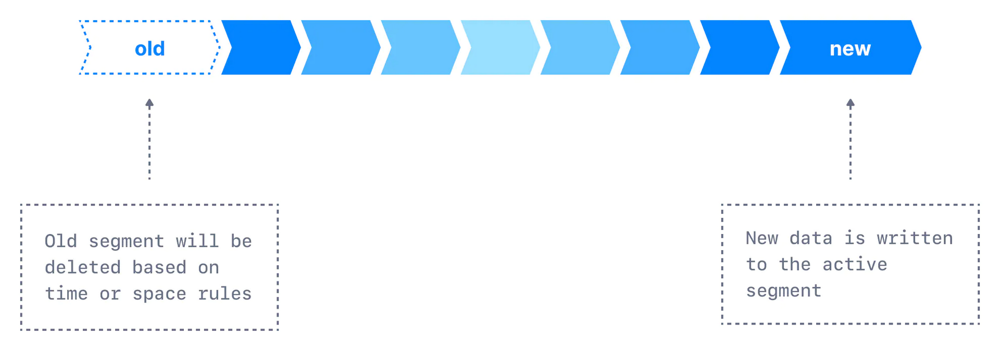
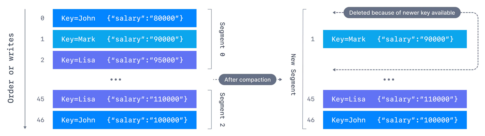

# Segments & Indices

Kafka brokers **split** **each partition into** **segments**. Each segment is stored in a single data file on the disk attached to the broker. By default, each **segment contains either 1 GB** of data or **a week of data**, whichever limit is attained first[[1]](#1).

Kafka allows consumers to start fetching messages from any available offset. To help brokers quickly locate the message for a given offset, Kafka maintains two indexes for each segment:

-   **An offset to position index** - It helps Kafka know what part of a segment to read to find a message
-   **A timestamp to offset index** - It allows Kafka to find messages with a specific timestamp

# Log Cleanup

Kafka stores messages for a set time and purges messages older than the retention period. This expiration happens due to a policy called `log.cleanup.policy`[[2]](#2). There are two cleanup policies:

-   `log.cleanup.policy=delete`
    -   This is the default for all the user topics. With this policy configured for a topic, Kafka deletes events older than the configured retention time. The default retention period is a week.
-   `log.cleanup.policy=compact`
    -   This policy is the default for Kafka's `__consumer_offsets` topic. With this policy on a topic, Kafka only stores the most recent value for each key in the topic. Setting the policy to compact only makes sense on topics for which applications produce events that contain both a key and a value.

## `log.cleanup.policy=delete`

-   **`log.retention.hours`**
    -   Number of hours to store data for - _(default is 168 - 1 week)_
    -   A higher number means more disk space
    -   lower number means less data is retained
-   **`log.retention.bytes`**
    -   max bytes for each partition
    -   useful to keep the data under a certain threshold

### Two use cases

-   **One week of retention**
    -   `log.retention.hours=168` and `log.retention.bytes=-1` (`-1` stands for infinite, _therefore infinite bytes_)
-   **Infinite retention bounded by 500MB**
    -   `log.retention.hours=-1`(`-1` stands for infinite, _therefore infinite time_) and `log.retention.bytes=524288000`

## Log Cleanup[[3]](#3)

Kafka can store messages for a set time and purge messages older than the retention period. However, imagine a case where Kafka is used for storing the salary information about all the employees in a company. In that case, it makes sense to store only the latest salary for each employee rather than the historical data for a limited time.

Kafka supports such use cases by allowing the retention policy on a topic to be set to compact, **with the property to only retain at least the most recent value for each key in the partition**. It is beneficial if we require a SNAPSHOT instead of a complete history.

---

<small>

[1] - [Kafka Topic Internals: Segments and Indexes](https://www.conduktor.io/kafka/kafka-topics-internals-segments-and-indexes/)

[2] - [Kafka Log Cleanup Policies](https://www.conduktor.io/kafka/kafka-topic-configuration-log-compaction/)

[2] - [Kafka Log Compaction Theory](https://www.conduktor.io/kafka/kafka-topic-configuration-log-compaction/#Kafka-Log-Compaction-Theory-1)

</small>
